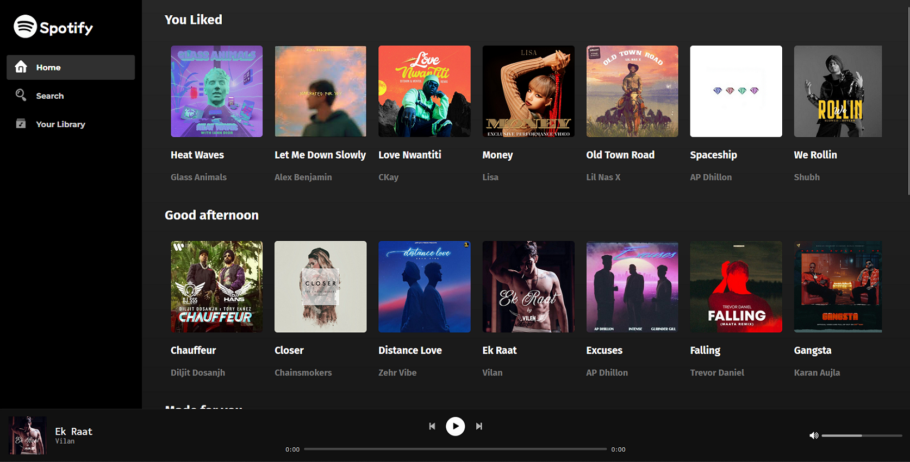

<h3 align="center"></h3>

<h1 align="center">Spotify Clone </h1>

<h3 align="center"><b> Live : https://spotify-d8fce.web.app/ </b></h3>

<a href="https://spotify-d8fce.web.app/" alt="Spotify"></a>

## Introduction
This project is a simplified version of <a href="https://open.spotify.com/" target="_blank">Spotify Player</a> build on Top of <a href="https://reactjs.org/" target="_blank"><b>ReactJS.</b></a>


## How To Use

To clone and run this application, you'll need [Git](https://git-scm.com) and [Node.js](https://nodejs.org/en/download/) (which comes with [npm](http://npmjs.com)) installed on your computer. From your command line:

```bash
# Clone this repository
$ git clone https://github.com/ChiragSindhu/SpotifyClone.git

# Install dependencies
$ npm install

# Run the app
$ npm start
```

## Special thanks to

- <a href="https://firebase.google.com/" target="_blank" ><b>Google Firebase</b></a>

- <a href="https://reactjs.org/" target="_blank"><b>ReactJS</b></a>

- <a href="https://www.npmjs.com/package/react-howler" target="_blank"><b>React Howler</b></a>

- <a href="https://nodejs.org/en/" target="_blank" ><b>NodeJS</b></a>

<a href="https://fonts.google.com" target="_blank" ></a>

## License
MIT

